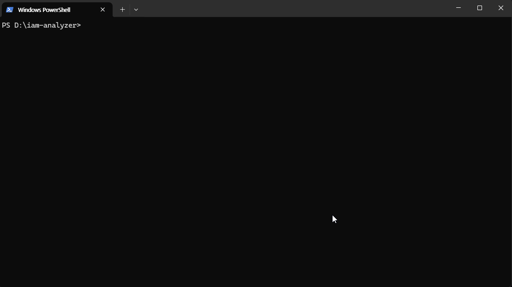
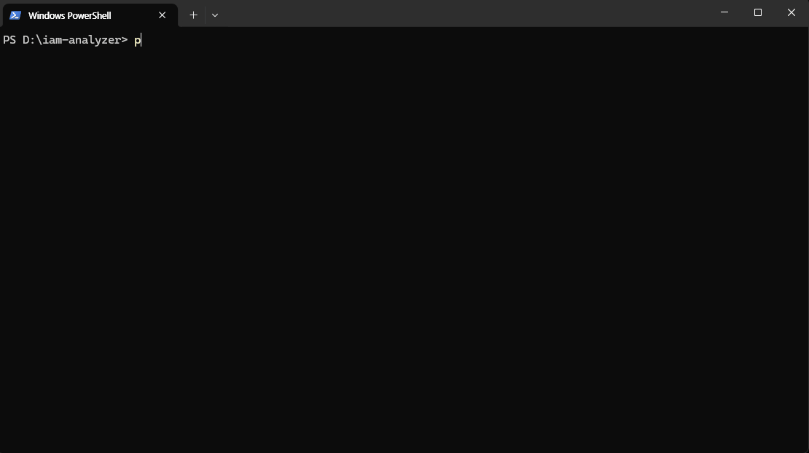
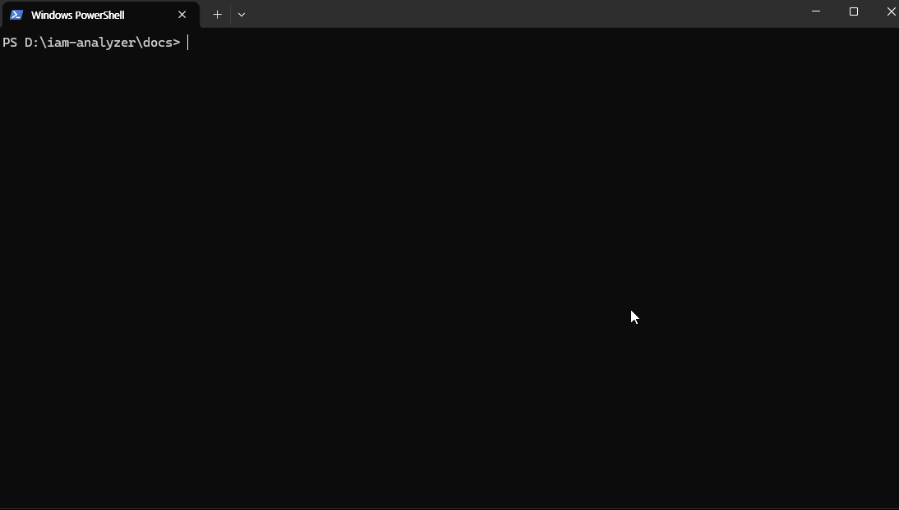

# Pasu - IAM Analyzer

**A lightweight CLI to analyze AWS IAM policies, explain risky access in plain English, and generate safer proposed policies.**

Pasu is a lightweight CLI tool that scans IAM policy JSON for security risks and explains them in plain English. No account setup, no cloud agent, no sales call — just `pip install pasu` and go.

### Mixed policy analysis


### Dangerous policy detection


### Auto-fix dangerous policies


---

## Install

```bash
pip install pasu
```

Requires Python 3.11+

## Usage

### Scan a policy (local analysis, no API key needed)
```bash
pasu scan --file policy.json
```

Runs both explain and escalate together. Shows a combined report with risk score, detected risky actions, and plain English explanations.

### Explain what a policy does
```bash
pasu explain --file policy.json
```

Translates IAM policy JSON into plain English that non-technical stakeholders can understand. Example: `"Action": "s3:PutBucketPolicy"` becomes "ALLOWS changing bucket security policy on all resources."

### Check for privilege escalation risks
```bash
pasu escalate --file policy.json
```

Scans for risky IAM actions and structural anti-patterns. Shows a risk score (0-100) with a visual bar.

### Generate a safer proposed policy
```bash
pasu fix --file policy.json
```

Generates a safer proposed policy and explains what still needs manual review:
- Removes dangerous high-risk actions when Pasu can do so safely
- Replaces service wildcards (for example `s3:*`) with safer read-only equivalents when a fix profile exists
- Flags `Resource: "*"` for manual scoping
- Preserves `Deny` statements
- Shows risk score before and after the proposed fix
- Leaves some medium-risk actions in place when auto-removing them would be unsafe or too context-dependent

Save the proposed policy to a file:
```bash
pasu fix --file policy.json --output fixed_policy.json
```

### Get AI-powered detailed analysis
```bash
export ANTHROPIC_API_KEY="sk-..."
pasu scan --file policy.json --ai
```

The `--ai` flag enables Claude-powered natural language explanations with specific remediation guidance. Without it, Pasu runs entirely locally at zero cost.

## What Pasu Detects

**High Risk (19 rules):**
- Wildcard actions (`"Action": "*"`) and wildcard resources (`"Resource": "*"`)
- IAM privilege escalation: iam:PassRole, iam:CreatePolicyVersion, iam:AttachRolePolicy, iam:AttachGroupPolicy, iam:PutRolePolicy, iam:CreateRole, iam:PutGroupPolicy, iam:AddUserToGroup, iam:AttachUserPolicy, iam:PutUserPolicy, iam:CreateLoginProfile, iam:UpdateLoginProfile, iam:SetDefaultPolicyVersion, iam:UpdateAssumeRolePolicy
- S3 public exposure: s3:PutBucketPolicy, s3:PutBucketAcl, s3:PutObjectAcl
- Code execution: lambda:CreateFunction, lambda:UpdateFunctionCode
- Infrastructure control: ec2:RunInstances
- Organization admin: organizations:*
- Encryption keys: kms:Decrypt

**Medium Risk (6 rules):**
- sts:AssumeRole, iam:CreateAccessKey
- Data access: s3:GetObject (with `Resource: "*"`) , dynamodb:Scan (with `Resource: "*"`)
- Secrets access: secretsmanager:GetSecretValue, ssm:GetParameter
- Reconnaissance: ec2:DescribeInstances
- Data exfiltration: rds:CopyDBSnapshot

**Structural Rules (5 rules):**
- Unrestricted resource access (`"Resource": "*"` on any action)
- Inverse action grants (`NotAction` — allows everything except listed actions)
- Inverse resource grants (`NotResource`)
- Sensitive actions with no `Condition` block
- Wildcard service grants (`"s3:*"`, `"iam:*"`, etc.)

**With `--ai` flag:**
- Detailed escalation path analysis
- Plain English explanation of each finding
- Specific remediation suggestions

---

## How It Works

Pasu uses a two-step analysis approach:

1. **Local detection (free, instant):** Rule-based scanning checks for known dangerous IAM action patterns and overly permissive policies. No network calls, no API keys.

2. **AI analysis (optional, `--ai`):** When risky actions are found, Claude AI provides detailed natural language explanations of *why* each permission is dangerous and *how* to fix it. Claude is only called when the local scan finds something.

### Rule data and scoring
Pasu's local analyzer loads its detection data from package-managed rule files instead of hardcoding everything directly in `analyzer.py`.

Current packaged rule/config files:
- `app/rules/risky_actions.yaml`
- `app/rules/scoring.yaml`
- `app/rules/fix_profiles.yaml`
- `app/data/aws_catalog.json`

This makes rule updates safer, easier to review, and easier to extend in later phases.

### AWS catalog sync foundation
Pasu now includes a local AWS catalog sync foundation script:
- `scripts/sync_aws_catalog.py`

Current behavior:
- Uses the AWS Service Authorization Reference as the source of truth
- Builds a canonical `app/data/aws_catalog.json` snapshot
- Generates diff reports for review at:
  - `reports/aws_catalog_diff.json`
  - `reports/aws_catalog_diff.md`
- Surfaces `new_unclassified_actions`, `services_with_new_unclassified_actions`, and `count_summary`

Current scope:
- Local script workflow is implemented and validated
- Canonical AWS catalog snapshot is committed to the repo
- GitHub Actions scheduling is the next step
- Risk-tier assignment remains review-based, not fully automatic

---

## Roadmap

- [x] CLI tool with local + AI analysis
- [x] PyPI package (`pip install pasu`)
- [x] More detection rules (S3 public access, cross-account trust)
- [x] Output formats (`--format json / table / sarif`)
- [x] `pasu fix` — generate safer proposed policies with manual review guidance
- [x] Externalized rule/scoring/fix data (`app/rules`, `app/data`)
- [x] AWS catalog sync + canonical snapshot foundation
- [ ] GitHub Actions scheduled AWS catalog sync + diff workflow
- [ ] Interactive shell mode
- [ ] Azure RBAC / Entra ID support
- [ ] GCP IAM support
- [ ] Team dashboard with shared reports

See [docs/PRODUCT_SPEC.md](docs/PRODUCT_SPEC.md) for the fuller roadmap and product direction.

---

## Why "Pasu"?

Pasu (파수/把守) is Korean for "guard" or "sentinel" — as in 파수꾼 (guard/watchman). Pasu guards the gates of your cloud infrastructure by making sure only the right permissions exist.

---

## CI/CD Integration

### JSON output for scripting

Use `--format json` to pipe results into other tools:

```bash
# Extract just the risk level
pasu scan --file policy.json --format json | jq '.escalate.risk_level'

# List all detected risky actions
pasu scan --file policy.json --format json | jq '.escalate.detected_actions[]'

# Fail CI if risk level is High
RISK=$(pasu scan --file policy.json --format json | jq -r '.escalate.risk_level')
[ "$RISK" = "High" ] && exit 1 || exit 0
```

### SARIF output for GitHub Code Scanning

Use `--format sarif` to generate a [SARIF v2.1.0](https://docs.oasis-open.org/sarif/sarif/v2.1.0/) report that GitHub understands natively:

```bash
pasu scan --file policy.json --format sarif > results.sarif
```

Upload the `.sarif` file with the `github/codeql-action/upload-sarif` action and findings will appear in the **Security → Code scanning** tab of your repository, with severity levels mapped automatically (`High` → error, `Medium` → warning).

See [examples/github-actions-workflow.yml](examples/github-actions-workflow.yml) for a ready-to-use GitHub Actions workflow.

---

## Development Notes

Recent analyzer refactor work kept the public CLI/API behavior stable while moving rule data out of code. The next backend step is not another large analyzer rewrite — it is automating the AWS catalog sync workflow in GitHub Actions so catalog refresh, diff generation, and human review happen on a schedule.

---

## Contributing

Contributions are welcome. Please open an issue first to discuss what you'd like to change.

## License

MIT